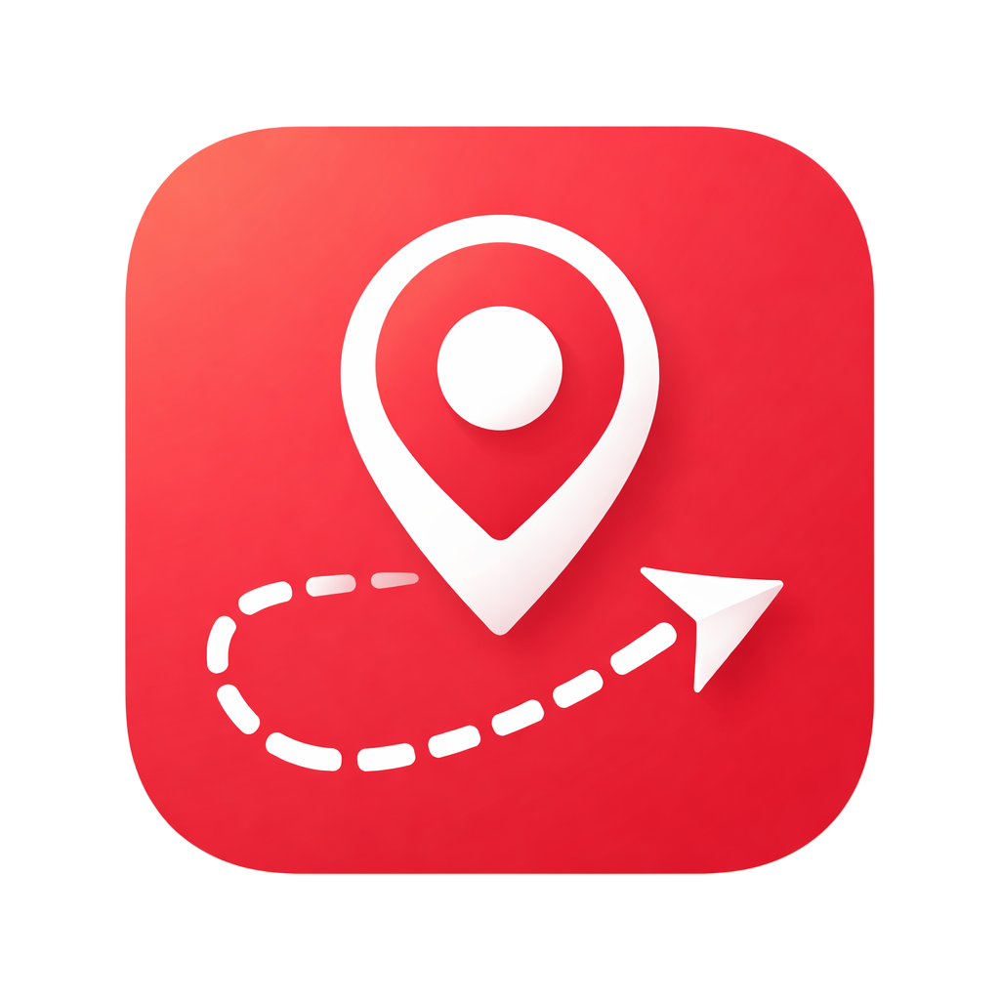

<p align="center">
  
</p>

<h1 align="center">Routezy</h1>

<p align="center">
  A lightweight GPS tracker for monitoring routes, distance, and movement activities.
</p>

<p align="center">
  
  
  
  
</p>

---

## Features

- **Real-time GPS tracking** — continuously monitors your location and draws your route live on a map
- **Location tracking history** — stores past tracking sessions so you can review previous routes and stats
- **Tracking configuration** — customize GPS accuracy, distance filter, and time limit to balance precision and battery usage

---

## Prerequisites

Make sure the following are installed before proceeding:

| Tool | Version |
|---|---|
| Flutter SDK | >= 3.0.0 |
| Dart SDK | >= 3.0.0 |
| Android Studio / Xcode | Latest stable |
| Java JDK | >= 17 |

---

## Getting Started

### 1. Clone the repository

```bash
git clone https://github.com/IlhamTe/routezy_mobile.git
cd routezy_mobile
```

### 2. Install dependencies

```bash
flutter pub get
```

### 3. Generate Hive adapters (required before building)

This project uses **Hive** for local storage. You must run the build runner to generate the type adapter files before compiling.

```bash
dart run build_runner build --delete-conflicting-outputs
```

> If you make changes to any Hive model (`@HiveType`), re-run this command to regenerate the adapters.

To watch for changes automatically during development:

```bash
dart run build_runner watch --delete-conflicting-outputs
```

### 4. Run the app

```bash
flutter run
```

To run on a specific device:

```bash
flutter devices                     # list available devices
flutter run -d <device-id>
```

---

## Build for Production

### Android

```bash
# APK
flutter build apk --release

# App Bundle (recommended for Play Store)
flutter build appbundle --release
```

Output: `build/app/outputs/`

### iOS

```bash
flutter build ios --release
```

Then open `ios/Runner.xcworkspace` in Xcode to archive and distribute.

---

## Project Structure

```
routezy_mobile/
├── assets/
│   └── fonts/
│   └── images/
│   └── lottie/
├── lib/
│   ├── app/                # Design system, route navigation, etc
│   │   ├── app.dart        # Entry point
│   ├── core/               # Data, constants, service, utilities
│   ├── features/
│   │   ├── tracking/       # Real-time GPS tracking
│   │   ├── history/        # Tracking history
│   │   └── settings/       # Tracking configuration
│   ├── widgets/            # Global re-usable widget
│   └── main.dart
├── test/
└── pubspec.yaml
```

---

## Permissions

### Android

Add the following to `android/app/src/main/AndroidManifest.xml`:

```xml
<uses-permission android:name="android.permission.ACCESS_FINE_LOCATION" />
<uses-permission android:name="android.permission.ACCESS_COARSE_LOCATION" />
<uses-permission android:name="android.permission.ACCESS_BACKGROUND_LOCATION" />
<uses-permission android:name="android.permission.FOREGROUND_SERVICE" />
<uses-permission android:name="android.permission.FOREGROUND_SERVICE_LOCATION" />
```

### iOS

Add the following to `ios/Runner/Info.plist`:

```xml
<key>NSLocationAlwaysAndWhenInUseUsageDescription</key>
<string>Routezy uses your location to track your routes, distance, and activities even when the app is running in the background.</string>

<key>NSLocationAlwaysUsageDescription</key>
<string>Routezy needs access to your location in the background to continuously record your routes and activities.</string>

<key>NSLocationWhenInUseUsageDescription</key>
<string>Routezy uses your location to track your route and display your movement on the map.</string>
    
<key>UIBackgroundModes</key>
  <array>
    <string>location</string>
  </array>
```

---

## Common Issues

**Build runner conflict error**

```bash
dart run build_runner build --delete-conflicting-outputs
```

The `--delete-conflicting-outputs` flag resolves conflicts from previously generated files.

**Location not updating in background (Android)**

Ensure `foregroundService: true` is set in `background_service.dart` configuration.

---

## Contributing

Contributions are welcome. Feel free to open issues or submit pull requests to improve Routezy.

---

## License

This project is intended for educational and technical test purposes.
